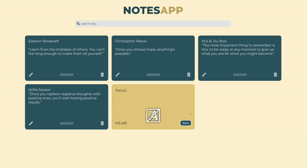

# Notes App 

Manage personal tasks with notes app. Has the ability to add, edit,search and delete notes. 
### :camera: Screenshot

## :hammer: Technologies & Tool

- React.JS
- LocalStorage
- Semantic HTML5 markup
- CSS custom properties
## :trophy: Features

- Users can add new notes.
- Users can modify notes
- Users ca search notes
- Users can delete notes
- Notes data stored in localStorage

### :bulb: Getting Started with Create React App

This project was bootstrapped with [Create React App](https://github.com/facebook/create-react-app).

### :computer: Useful resources

- [ReactJS](https://reactjs.org/tutorial/tutorial.html) - How to set up a local development environment on your computer
- [MDN](https://developer.mozilla.org/en-US/docs/Web/API/Window/localStorage) - Window.localStorage
- [Scrimba](https://scrimba.com/learn/learnjavascript/your-first-localstorage-coaa54cbd950661b84f5857b7) - How to use localStorage
- [SimplerNerd](https://simplernerd.com/js-get-substring-before-char/) - How to Get the Substring Before a Character in JavaScript
- [BobbyHadz](https://bobbyhadz.com/blog/javascript-remove-non-alphanumeric-characters-from-string) - Remove all non-alphanumeric Characters from String in JS
- [GeeksForGeeks](https://www.geeksforgeeks.org/javascript-array-unshift-method/) - JavaScript Array unshift() Method

## :bust_in_silhouette: Author

- Website - [Farai Major](https://faraimajor.com/)
